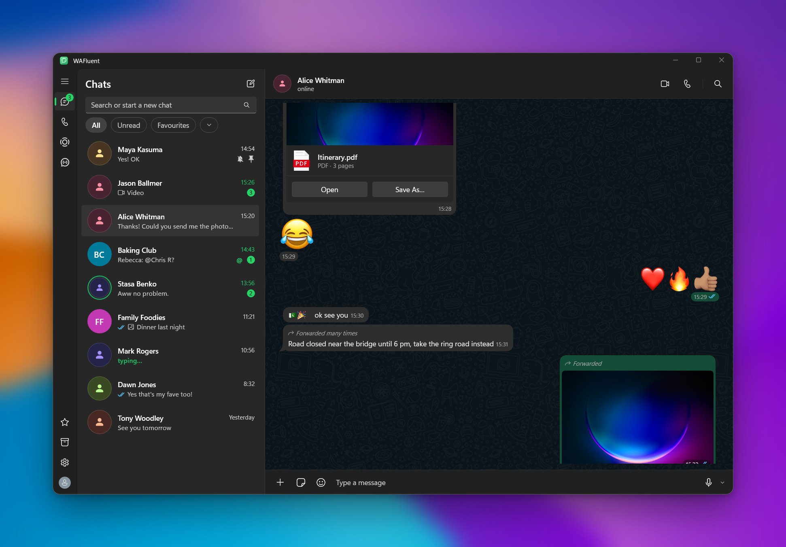
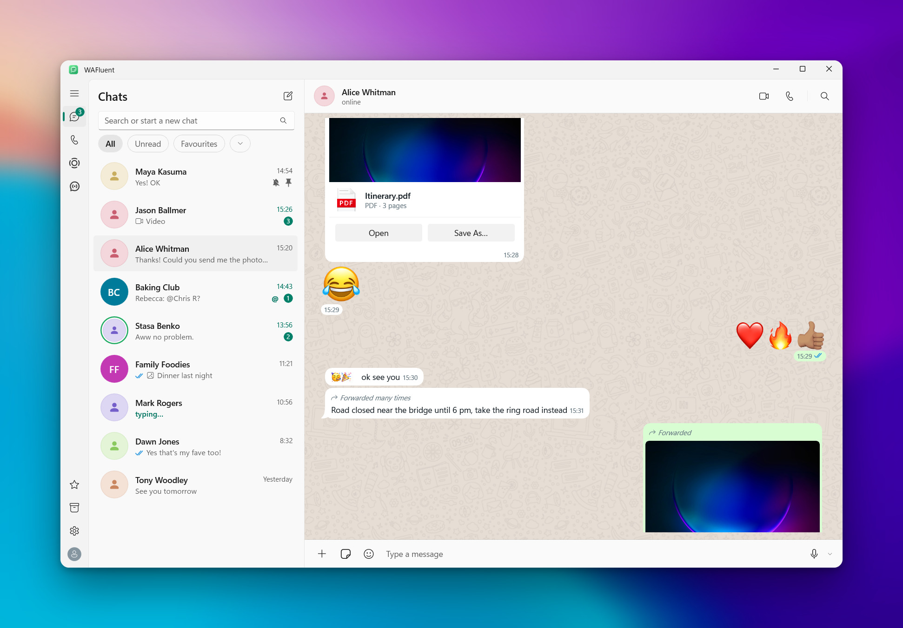
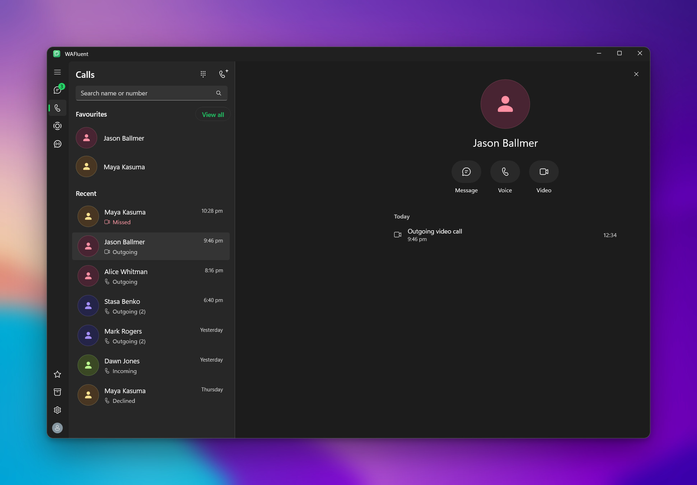
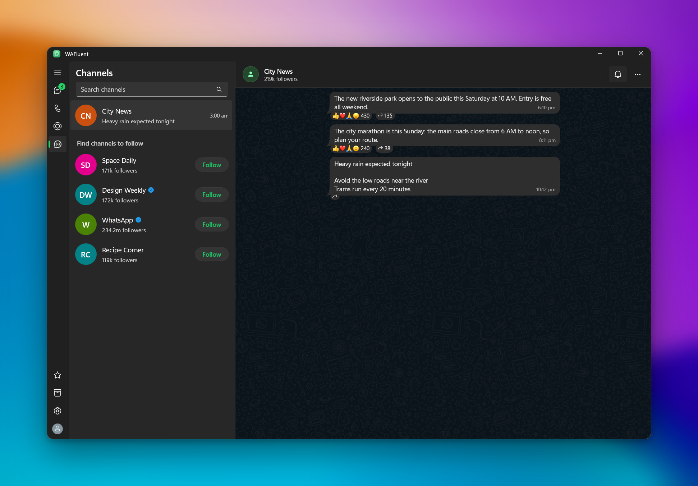
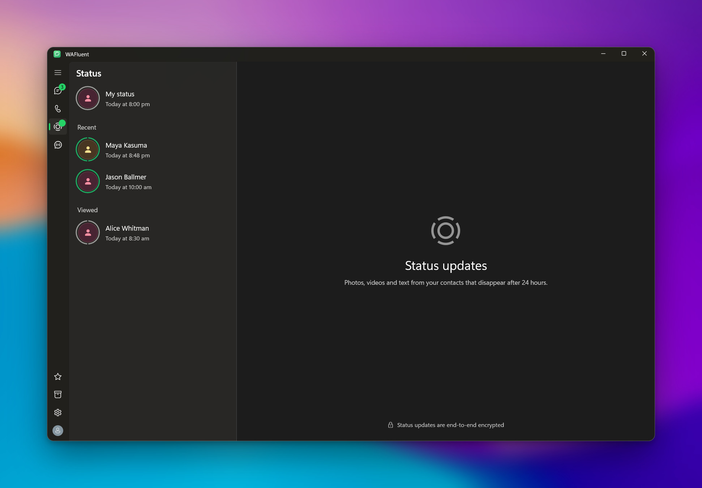

# WAFluent

A native WhatsApp client for Windows 11, built with WinUI 3. Fluent design, light and dark themes, and no browser engine.

> [!TIP]
> **About a third of the memory.** WAFluent used **~115 MB** of RAM, app and backend together, where WhatsApp Desktop used
> ~330 MB on the same PC. It also ran 3 processes instead of 9.
>
> <sub>Private working set of each app's whole process tree, both idle, measured once on one Windows 11 PC. Your numbers will vary.</sub>



| Light theme | Calls |
|---|---|
|  |  |
| **Channels** | **Status** |
|  |  |

<sub>Screenshots show the app's built-in sample chats, not a real account.</sub>

> [!WARNING]
> WAFluent is unofficial and not affiliated with WhatsApp or Meta. Unofficial clients can get accounts suspended;
> use a spare number while trying it.

## Features

- **Chats**: link your phone with a QR code and get your real chats: text, photos, videos, GIFs, stickers, voice notes,
  documents, locations, contact cards, polls and link previews.
- **Messages**: reply, react, forward, pin, star, edit, delete, select several, and mention people in groups.
- **Calls**: voice and video calls with one person, call history, favourites, a number pad and call links.
- **Status**: your contacts' updates, with replies.
- **Channels**: follow, mute and read channels, and react to posts.
- **Windows**: notifications you can reply from, a tray icon, light and dark themes, and your Windows accent colour if you want it.

Group calls and posting your own status aren't supported yet.

## Build

You need the .NET 10 SDK and Rust (`rustup`) on Windows 10 2004 or later.

```powershell
cd src
dotnet build -p:Platform=x64
.\bin\x64\Debug\net10.0-windows10.0.26100.0\win-x64\WAFluent.exe
```

Add `--sample` to open the app on placeholder chats without linking a phone.

Two optional files are not in the repo. The app builds and runs without them:

- `src/giphy.key`: your own [GIPHY API key](https://developers.giphy.com/) on one line. Without it, GIF search is empty.
- `src/Assets/Fonts/AppleColorEmoji.ttf`: an emoji font of your choice saved under that name. Without it, Windows' emoji are used.

To make the installer (`dist\WAFluent-<version>-setup.exe`) you also need [Inno Setup 6](https://jrsoftware.org/isinfo.php):

```powershell
cd src
dotnet build -c Release -p:Platform=x64 --self-contained true -p:Version=0.1.0
& "$env:LOCALAPPDATA\Programs\Inno Setup 6\ISCC.exe" ..\tools\installer.iss
```

## How it works

The app is two programs. `src/` is the WinUI app you see. `core/` is a small Rust program, built on
[whatsapp-rust](https://crates.io/crates/whatsapp-rust), that handles pairing, encryption and the connection to WhatsApp.
The app starts the core and the two talk over JSON lines.

Your chats and the link to your phone are stored on your PC in `%LOCALAPPDATA%\WAFluent`.
**Profile → Log out** unlinks the device and deletes them.

## Credits

- [whatsapp-rust](https://crates.io/crates/whatsapp-rust): the WhatsApp connection.
- [emojibase](https://github.com/milesj/emojibase) (MIT): emoji names and shortcodes.
- [H.NotifyIcon](https://github.com/HavenDV/H.NotifyIcon) (MIT): the tray icon.
- Chat wallpaper: WhatsApp's doodle tiles ([source](https://gist.github.com/abdurrahmanekr/2747d704edec93a06e454eba2653e0df)).
- Screenshot background: a photo by [Milad Fakurian](https://unsplash.com/@fakurian) on [Unsplash](https://unsplash.com/photos/E8Ufcyxz514).
